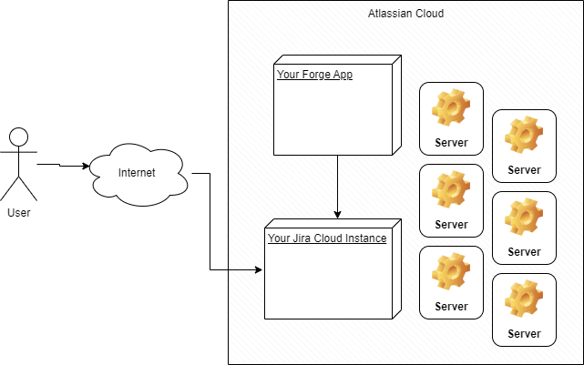
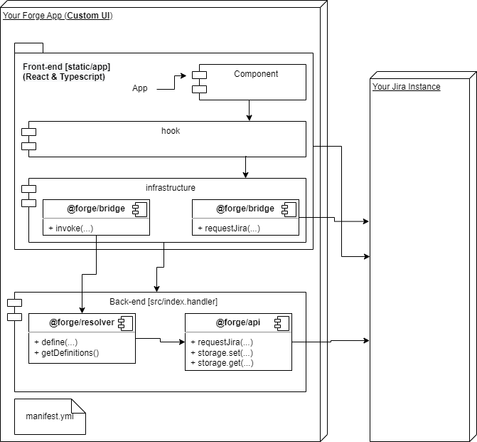

# Custom UI Example


This is a Jira Forge sample application (Custom UI) that can be used as a base to start a new project.
Custom UI for more flexibility with developer-defined JavaScript, CSS, and HTML in a secured iframe hosted by Atlassian. In this case the stack is React 16 and Typescript.

Reference: 
https://developer.atlassian.com/platform/forge/custom-ui/
https://atlaskit.atlassian.com/
https://developer.atlassian.com/platform/marketplace/listing-forge-apps/

See [developer.atlassian.com/platform/forge/](https://developer.atlassian.com/platform/forge) for documentation and tutorials explaining Forge.

# Architecture

Forge makes it possible to build a fully-functional app, with hosting, multiple development environments, and API authentication built-in. Forge can be used to build custom apps and integrations or apps distributed through the Atlassian Marketplace. With the built-in Storage API, Jira API, FaaS and triggers, one can operate apps with virtually no owned infrastructure – which also makes the entire operation model not only incredibly cheap but also much more secure.







## Requirements

See [Set up Forge](https://developer.atlassian.com/platform/forge/set-up-forge/) for instructions to get set up.

## Quick start
- Install dependencies (inside of the `static/hello-world` directory)::
```
npm install
```

- Modify your app by editing the files in `static/hello-world/src/`.

- Build your app (inside of the `static/hello-world` directory):
```
npm run build
```

- Deploy your app by running:
```
forge deploy
```

- Install your app in an Atlassian site by running:
```
forge install
```

### Notes
- Use the `forge deploy` command when you want to persist code changes.
- Use the `forge install` command when you want to install the app on a new site.
- Once the app is installed on a site, the site picks up the new app changes you deploy without needing to rerun the install command.

## Support

See [Get help](https://developer.atlassian.com/platform/forge/get-help/) for how to get help and provide feedback.

